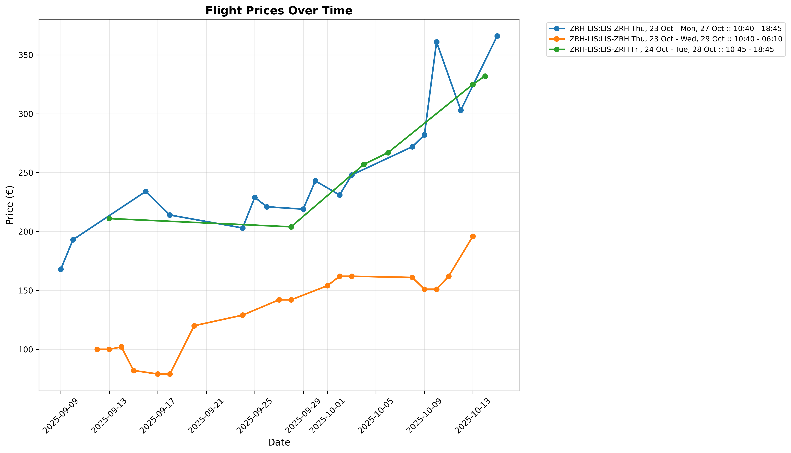

# Flight Price Tracker

A Python program that extracts flight price data from Skyscanner email updates and creates visualizations to track price changes over time.



## Features

- Parses Skyscanner price alert emails from an mbox file
- Supports three types of emails:
  - Italian emails with one roundtrip flight
  - English emails with one roundtrip flight
  - English emails with two roundtrip flights
- Extracts flight details: dates, times, airports, and prices
- **Date normalization**: Automatically converts Italian dates to English format for consistent grouping
- Generates a CSV file with all extracted data
- Creates a line plot showing price trends over time for each flight route

## Requirements

- Python 3.8+
- matplotlib
- pandas

## Installation

1. Install the required packages:
```bash
pip install -r requirements.txt
```

Or if using the virtual environment:
```bash
.venv/bin/pip install -r requirements.txt
```

## Usage

1. Export your Skyscanner price alert emails to an mbox file and place it in the project directory as `Skyscanner.mbox/mbox`

2. Run the program:
```bash
python flight_price_tracker.py
```

Or with virtual environment:
```bash
.venv/bin/python flight_price_tracker.py
```

3. The program will:
   - Parse all emails in the mbox file
   - Extract flight price information
   - Save the data to `prices.csv`
   - Generate a plot saved as `flight_prices_plot.png`
   - Display the plot

## CSV Output Format

The generated CSV file contains the following columns:

- **date**: Email date (when the price was tracked)
- **direction1**: First flight direction (e.g., "ZRH-LIS")
- **date1**: Departure date of first flight
- **time1**: Departure time of first flight
- **direction2**: Return flight direction (e.g., "LIS-ZRH")
- **date2**: Departure date of return flight
- **time2**: Departure time of return flight
- **price**: Total price in EUR
- **label**: Legend label for the plot (e.g., "ZRH-LIS:LIS-ZRH Fri, 24 Oct - Tue, 28 Oct :: 10:45 - 18:45")

## Plot

The generated plot shows:
- X-axis: Date when the price was tracked
- Y-axis: Price in EUR
- Each unique flight combination (same dates and times) is shown as a separate line with a different color
- Legend shows all tracked flight combinations
- Dates are normalized to English format for consistent grouping across Italian and English emails

### Example Output

The plot above demonstrates price tracking for round-trip flights between Zurich (ZRH) and Lisbon (LIS). You can see:
- Multiple flight options tracked over time (September to October 2025)
- Price trends showing when prices go up or down
- Different departure/return date combinations as separate lines
- Clear visualization of the best times to book based on historical price data

## Example Files

The repository includes example files for reference:
- `SkyscannerEmail_toTune-1.eml` - Italian email with one roundtrip
- `SkyscannerEmail_toTune-1-en.eml` - English email with one roundtrip
- `SkyscannerEmail_toTune-2-en.eml` - English email with two roundtrips
- `prices_handmade.csv` - Example CSV output

## How It Works

The program:
1. Opens the mbox file and iterates through all emails
2. Detects the email type (Italian/English, single/double flight)
3. Uses regex patterns to extract:
   - Flight dates and times
   - Airport codes (departure and destination)
   - Prices
4. **Normalizes dates**: Converts Italian date names (e.g., "gio 23 ott") to English format (e.g., "Thu, 23 Oct") for consistency
5. Formats the data according to the CSV schema
6. Creates visualizations using matplotlib with grouped data by flight combination

## Key Features Explained

### Multi-line Pattern Matching
The program uses sophisticated pattern matching to extract airport codes that appear on separate lines in the email format:
```
10:40 -
12:35

ZRH -
LIS,
```

### Date Normalization
Italian and English emails are automatically reconciled:
- Italian: "gio 23 ott" → English: "Thu, 23 Oct"
- Italian: "mer 29 ott" → English: "Wed, 29 Oct"

This ensures that the same flight tracked through both Italian and English emails appears as a single line in the plot.

## Troubleshooting

If the program doesn't extract data correctly:
- Verify the mbox file path is correct
- Check that the emails are from Skyscanner price alerts
- Ensure the email format matches one of the three supported types
- Check the console output for parsing errors

## How to Export an mbox File from Common Email Apps

To use this program, you need to export your Skyscanner price alert emails as an mbox file. Here are guides for the most common email clients:

### Apple Mail (macOS)
1. Select the mailbox or folder containing your Skyscanner emails.
2. Go to `Mailbox` > `Export Mailbox...` in the menu bar.
3. Choose a destination and save. The exported file will be in mbox format.
4. Rename the file to `mbox` and place it in the `Skyscanner.mbox` folder in this project.

### Mozilla Thunderbird
1. Install the "ImportExportTools NG" add-on (if not already installed).
2. Right-click the folder containing your Skyscanner emails.
3. Select `ImportExportTools NG` > `Export folder`.
4. Choose `mbox` format and save the file.
5. Rename and move the file as above.

### Microsoft Outlook (Windows/Mac)
Outlook does not natively export to mbox. You can:
- Forward your Skyscanner emails to a Gmail account and use Gmail's export (see below)
- Or use a third-party tool to convert PST/OST to mbox

### Gmail (Web)
1. Go to Google Takeout: https://takeout.google.com/
2. Select only "Mail" and choose the label/folder with your Skyscanner emails.
3. Export and download the archive.
4. Extract the archive; the mail will be in mbox format.
5. Rename and move the file as above.

### General Tips
- Always filter or move your Skyscanner emails to a dedicated folder before export for best results.
- After export, ensure the file is named `mbox` and placed inside the `Skyscanner.mbox` directory in this project.
- If you have trouble, search for "export mbox from [your email app]" for more detailed instructions.